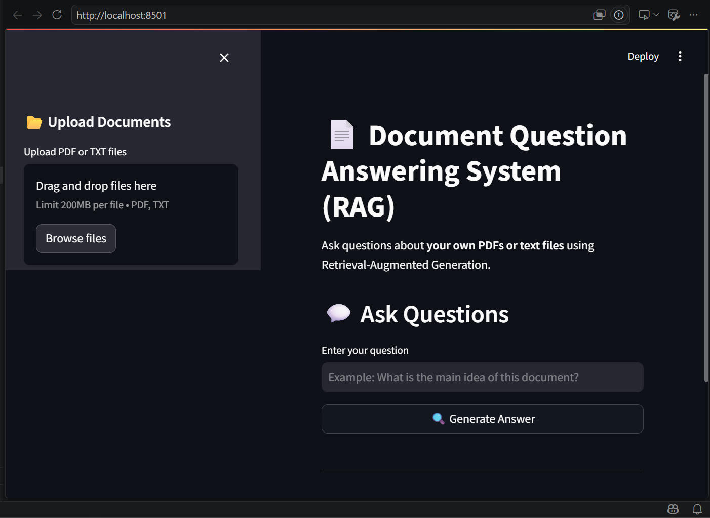
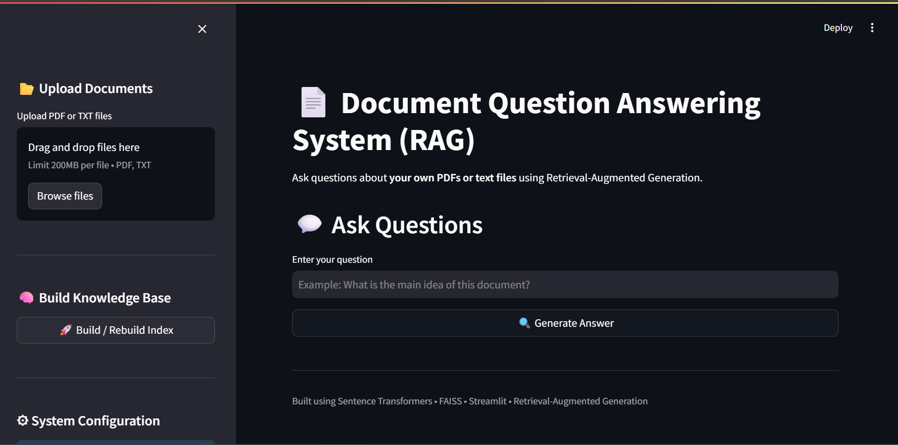
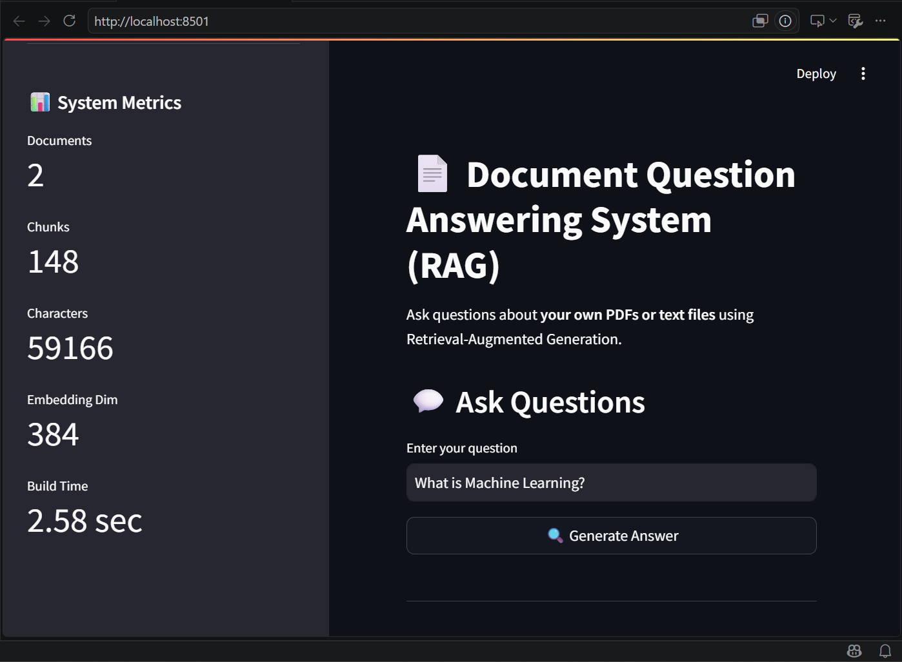
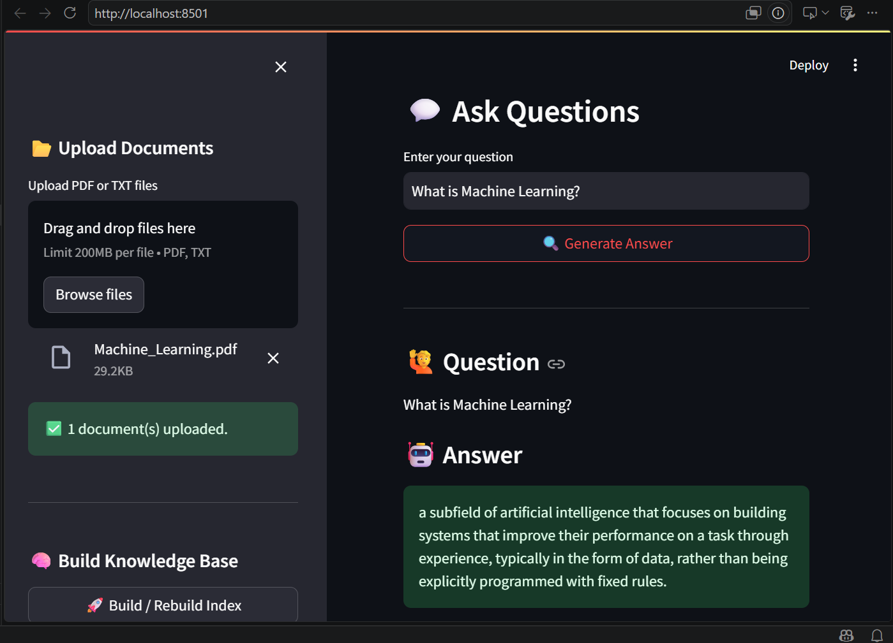

# 📄 RAG Document Question Answering System

## Overview

This project implements a **Retrieval-Augmented Generation (RAG)** pipeline that answers user questions using information retrieved from custom PDF and text documents.

The system performs document ingestion, text chunking, embedding generation, semantic similarity search using **FAISS**, and answer generation using a **Large Language Model (LLM)**.

Developed as part of the **Celebal Technologies – Week 7 Internship Assignment**.

---

# Features

- 📄 PDF & TXT document support
- ✂️ Automatic text chunking with overlap
- 🧠 Sentence Transformer embeddings
- 🔍 Semantic similarity search using FAISS
- 🤖 Local LLM support (FLAN-T5)
- ☁️ OpenAI & Anthropic backend support
- 💬 Interactive Streamlit web interface
- 💻 Command Line Interface (CLI)
- 📊 Retrieval metrics and system statistics
- 📚 Source attribution for generated answers

---

# Project Architecture

```
                PDF / TXT Documents
                        │
                        ▼
               Document Loading
                        │
                        ▼
                 Text Chunking
                        │
                        ▼
          Sentence Transformer Embeddings
                        │
                        ▼
              FAISS Vector Database
                        │
                        ▼
                User Question
                        │
                        ▼
              Query Embedding
                        │
                        ▼
          Top-K Similarity Retrieval
                        │
                        ▼
           FLAN-T5 / OpenAI / Claude
                        │
                        ▼
              Context-Aware Answer
```

---

# Technologies Used

| Component | Technology |
|-----------|------------|
| Language | Python 3.10+ |
| UI | Streamlit |
| Embeddings | Sentence Transformers |
| Vector Database | FAISS |
| Local LLM | Google FLAN-T5 |
| Cloud LLM | OpenAI / Anthropic |
| PDF Parser | PyPDF |
| Deep Learning | PyTorch |
| Environment | python-dotenv |

---

# Project Structure

```
rag_project/
│
├── app.py
├── main.py
├── config.py
├── requirements.txt
├── README.md
│
├── assets/
│   ├── home_page.png
│   ├── upload_documents.png
│   ├── system_metrics.png
│   ├── question_answer.png
│
├── data/
├── vector_index/
└── src/
```

---

# Workflow

1. Upload PDF/TXT documents.
2. Split documents into overlapping chunks.
3. Generate embeddings using Sentence Transformers.
4. Store embeddings in a FAISS vector database.
5. Convert the user's question into an embedding.
6. Retrieve the most relevant chunks.
7. Generate a grounded answer using the selected LLM.

---

# Experimental Results

The chunk size was varied to observe its impact on retrieval quality.

| Chunk Size | Overlap | Chunks | Best Similarity | Response Time | Observation |
|------------|---------|--------|-----------------|---------------|-------------|
| 300 | 50 | 3 | 0.4620 | 3.12 sec | Higher retrieval precision |
| 500 | 100 | 2 | 0.3426 | 4.40 sec | Balanced configuration (Selected) |
| 800 | 150 | 1 | 0.3813 | 3.05 sec | Single large chunk, less effective retrieval |

**Final Configuration**

| Parameter | Value |
|-----------|-------|
| Embedding Model | all-MiniLM-L6-v2 |
| Chunk Size | 500 |
| Chunk Overlap | 100 |
| Vector Database | FAISS |
| Top-K Retrieval | 4 |
| Local LLM | google/flan-t5-base |

---

# Screenshots

## Home Page



---

## Document Upload



---

## System Metrics



---

## Question Answering



---

# Installation

```bash
git clone <repository-url>

cd rag_project

python -m venv venv

# Windows
venv\Scripts\activate

pip install -r requirements.txt
```

---

# Running the Project

### Build the Vector Index

```bash
python main.py ingest
```

### Ask Questions (CLI)

```bash
python main.py query "What is Machine Learning?"
```

### Launch Streamlit

```bash
streamlit run app.py
```

---

# Sample Dataset

The final project was evaluated using multiple PDF documents (~59,000+ characters), producing:

- Documents Indexed: **2**
- Total Chunks: **148**
- Embedding Dimension: **384**
- Vector Database: **FAISS**

---

# Learning Outcomes

Through this project, the following concepts were implemented:

- Retrieval-Augmented Generation (RAG)
- Semantic Search
- Vector Databases (FAISS)
- Sentence Embeddings
- Prompt Engineering
- Local Large Language Models
- Streamlit Application Development
- Modular AI Pipeline Design

---

# Future Improvements

- Hybrid Search (BM25 + FAISS)
- Cross-Encoder Re-ranking
- OCR support for scanned PDFs
- Conversation Memory
- DOCX & Markdown support
- Multi-document reasoning

---

# Author

**Harsh Vardhan Shekhawat**

**Celebal Technologies Internship – Week 7 Assignment**